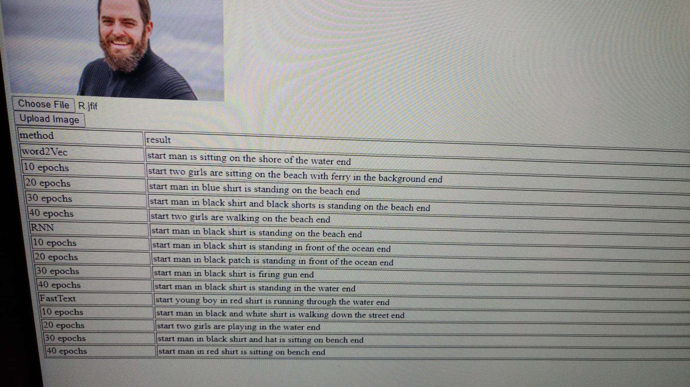

# Image Captioning using CNN plus RNN / FastText / Word2Vec with LSTM

This is the finial project for my Data Science Course with topic "Image Captioning using CNN plus RNN / FastText / Word2Vec with LSTM". 

## Summary

This project is about training a Deep leaning model using Convolutional Neural Network (CNN) with Recurrent Neural Networks (RNN) plus Long short-term memory (LSTM) aiming to provide captioning for any image provided. The RNN embedded layer would be replaced by FastText / Word2Vec embedded layer as to compare the result between these 3 different models.


## Background

This project is aiming to train a reliable image captioning model which could be first apply to random daily photo, and then to some specific domain image captioning once the dataset could be increased by obtained any image-captioning source from third-party / organisation.  

Image-captioning could solve - 
* Inspection / quality checking
* Quality assurance
* Public violation activities
* Public monitoring system


## How is it used?



## Data sources and AI methods


CNN + fastText + LSTM
```
TensorFlow version: 2.7.0
Num GPUs Available:  1
Num CPUs Available:  1
Length of descriptions = 8092
Length of vocabulary =  8763
7577
32
(47, 2048) (47, 32) (47, 7577)
Dataset:  6000
Descriptions: train= 6000
Photos: train= 6000
Vocabulary Size: 7577
Description Length:  32
2023-02-09 03:29:56.283320: I tensorflow/core/platform/cpu_feature_guard.cc:151] This TensorFlow binary is optimized with oneAPI Deep Neural Network Library (oneDNN) to use the following CPU instructions in performance-critical operations:  AVX AVX2
To enable them in other operations, rebuild TensorFlow with the appropriate compiler flags.
2023-02-09 03:29:56.625356: I tensorflow/core/common_runtime/gpu/gpu_device.cc:1525] Created device /job:localhost/replica:0/task:0/device:GPU:0 with 9599 MB memory:  -> device: 0, name: NVIDIA GeForce RTX 3060, pci bus id: 0000:01:00.0, compute capability: 8.6
Model: "model"
__________________________________________________________________________________________________
 Layer (type)                   Output Shape         Param #     Connected to
==================================================================================================
 input_2 (InputLayer)           [(None, 32)]         0           []

 input_1 (InputLayer)           [(None, 2048)]       0           []

 embedding (Embedding)          (None, 32, 10)       88290       ['input_2[0][0]']

 dropout (Dropout)              (None, 2048)         0           ['input_1[0][0]']

 dropout_1 (Dropout)            (None, 32, 10)       0           ['embedding[0][0]']

 dense (Dense)                  (None, 256)          524544      ['dropout[0][0]']

 lstm (LSTM)                    (None, 256)          273408      ['dropout_1[0][0]']

 add (Add)                      (None, 256)          0           ['dense[0][0]',
                                                                  'lstm[0][0]']

 dense_1 (Dense)                (None, 256)          65792       ['add[0][0]']

 dense_2 (Dense)                (None, 7577)         1947289     ['dense_1[0][0]']

==================================================================================================
Total params: 2,899,323
Trainable params: 2,811,033
Non-trainable params: 88,290
__________________________________________________________________________________________________
None
('You must install pydot (`pip install pydot`) and install graphviz (see instructions at https://graphviz.gitlab.io/download/) ', 'for plot_model/model_to_dot to work.')
C:\Users\User\repo\ai-training-project\ai_training_project_poetry\model\training.py:317: UserWarning: `Model.fit_generator` is deprecated and will be removed in a future version. Please use `Model.fit`, which supports generators.
  model.fit_generator(generator, epochs=1, steps_per_epoch= steps, verbose=1)
2023-02-09 03:29:59.014936: I tensorflow/stream_executor/cuda/cuda_blas.cc:1774] TensorFloat-32 will be used for the matrix multiplication. This will only be logged once.
2023-02-09 03:29:59.516411: I tensorflow/stream_executor/cuda/cuda_dnn.cc:366] Loaded cuDNN version 8201
6000/6000 [==============================] - 33s 5ms/step - loss: 5.0670
C:\Users\User\anaconda3\envs\tf_gpu\lib\site-packages\keras\engine\functional.py:1410: CustomMaskWarning: Custom mask layers require a config and must override get_config. When loading, the custom mask layer must be passed to the custom_objects argument.
  layer_config = serialize_layer_fn(layer)
6000/6000 [==============================] - 30s 5ms/step - loss: 4.4214
6000/6000 [==============================] - 30s 5ms/step - loss: 4.1975
6000/6000 [==============================] - 31s 5ms/step - loss: 4.0618
6000/6000 [==============================] - 31s 5ms/step - loss: 3.9793
6000/6000 [==============================] - 35s 6ms/step - loss: 3.9127
6000/6000 [==============================] - 156s 26ms/step - loss: 3.8655
6000/6000 [==============================] - 31s 5ms/step - loss: 3.8217
6000/6000 [==============================] - 31s 5ms/step - loss: 3.7932
6000/6000 [==============================] - 31s 5ms/step - loss: 3.7688
6000/6000 [==============================] - 31s 5ms/step - loss: 3.7425
6000/6000 [==============================] - 31s 5ms/step - loss: 3.7288
6000/6000 [==============================] - 31s 5ms/step - loss: 3.7157
6000/6000 [==============================] - 31s 5ms/step - loss: 3.7030
6000/6000 [==============================] - 31s 5ms/step - loss: 3.6908
6000/6000 [==============================] - 30s 5ms/step - loss: 3.6791
6000/6000 [==============================] - 31s 5ms/step - loss: 3.6714
6000/6000 [==============================] - 30s 5ms/step - loss: 3.6654
6000/6000 [==============================] - 30s 5ms/step - loss: 3.6599
6000/6000 [==============================] - 31s 5ms/step - loss: 3.6578
6000/6000 [==============================] - 30s 5ms/step - loss: 3.6550
6000/6000 [==============================] - 31s 5ms/step - loss: 3.6535
6000/6000 [==============================] - 30s 5ms/step - loss: 3.6409
6000/6000 [==============================] - 30s 5ms/step - loss: 3.6398
6000/6000 [==============================] - 31s 5ms/step - loss: 3.6355
6000/6000 [==============================] - 31s 5ms/step - loss: 3.6279
6000/6000 [==============================] - 30s 5ms/step - loss: 3.6306
6000/6000 [==============================] - 30s 5ms/step - loss: 3.6298
6000/6000 [==============================] - 30s 5ms/step - loss: 3.6316
6000/6000 [==============================] - 30s 5ms/step - loss: 3.6287
6000/6000 [==============================] - 30s 5ms/step - loss: 3.6322
6000/6000 [==============================] - 30s 5ms/step - loss: 3.6307
6000/6000 [==============================] - 30s 5ms/step - loss: 3.6320
6000/6000 [==============================] - 30s 5ms/step - loss: 3.6304
6000/6000 [==============================] - 31s 5ms/step - loss: 3.6306
6000/6000 [==============================] - 31s 5ms/step - loss: 3.6268
6000/6000 [==============================] - 31s 5ms/step - loss: 3.6299
6000/6000 [==============================] - 30s 5ms/step - loss: 3.6272
6000/6000 [==============================] - 30s 5ms/step - loss: 3.6301
6000/6000 [==============================] - 30s 5ms/step - loss: 3.6274
6000/6000 [==============================] - 30s 5ms/step - loss: 3.6315
6000/6000 [==============================] - 30s 5ms/step - loss: 3.6317
6000/6000 [==============================] - 31s 5ms/step - loss: 3.6361
6000/6000 [==============================] - 30s 5ms/step - loss: 3.6374
6000/6000 [==============================] - 30s 5ms/step - loss: 3.6336
6000/6000 [==============================] - 30s 5ms/step - loss: 3.6353
6000/6000 [==============================] - 31s 5ms/step - loss: 3.6410
6000/6000 [==============================] - 30s 5ms/step - loss: 3.6411
6000/6000 [==============================] - 30s 5ms/step - loss: 3.6435
6000/6000 [==============================] - 30s 5ms/step - loss: 3.6443
6000/6000 [==============================] - 30s 5ms/step - loss: 3.6490
6000/6000 [==============================] - 30s 5ms/step - loss: 3.6489
6000/6000 [==============================] - 30s 5ms/step - loss: 3.6506
6000/6000 [==============================] - 30s 5ms/step - loss: 3.6474
6000/6000 [==============================] - 30s 5ms/step - loss: 3.6513
6000/6000 [==============================] - 31s 5ms/step - loss: 3.6498
6000/6000 [==============================] - 30s 5ms/step - loss: 3.6565
6000/6000 [==============================] - 30s 5ms/step - loss: 3.6530
6000/6000 [==============================] - 30s 5ms/step - loss: 3.6502
6000/6000 [==============================] - 30s 5ms/step - loss: 3.6607
6000/6000 [==============================] - 30s 5ms/step - loss: 3.6520
6000/6000 [==============================] - 30s 5ms/step - loss: 3.6592
6000/6000 [==============================] - 30s 5ms/step - loss: 3.6607
6000/6000 [==============================] - 30s 5ms/step - loss: 3.6611
```


CNN + Word2Vec + LSTM
```
 Layer (type)                   Output Shape         Param #     Connected to
==================================================================================================
 input_2 (InputLayer)           [(None, 32)]         0           []

 input_1 (InputLayer)           [(None, 2048)]       0           []

 embedding (Embedding)          (None, 32, 300)      2273100     ['input_2[0][0]']

 dropout (Dropout)              (None, 2048)         0           ['input_1[0][0]']

 dropout_1 (Dropout)            (None, 32, 300)      0           ['embedding[0][0]']

 dense (Dense)                  (None, 256)          524544      ['dropout[0][0]']

 lstm (LSTM)                    (None, 256)          570368      ['dropout_1[0][0]']

 add (Add)                      (None, 256)          0           ['dense[0][0]',
                                                                  'lstm[0][0]']

 dense_1 (Dense)                (None, 256)          65792       ['add[0][0]']

 dense_2 (Dense)                (None, 7577)         1947289     ['dense_1[0][0]']

==================================================================================================

6000/6000 [==============================] - 32s 5ms/step - loss: 3.5970
6000/6000 [==============================] - 33s 5ms/step - loss: 3.3635
6000/6000 [==============================] - 32s 5ms/step - loss: 3.2224
6000/6000 [==============================] - 32s 5ms/step - loss: 3.1267
6000/6000 [==============================] - 33s 5ms/step - loss: 3.0571
6000/6000 [==============================] - 33s 5ms/step - loss: 3.0079
6000/6000 [==============================] - 32s 5ms/step - loss: 2.9651
6000/6000 [==============================] - 32s 5ms/step - loss: 2.9302
6000/6000 [==============================] - 33s 5ms/step - loss: 2.9054
6000/6000 [==============================] - 32s 5ms/step - loss: 2.8820
6000/6000 [==============================] - 32s 5ms/step - loss: 2.8641
6000/6000 [==============================] - 32s 5ms/step - loss: 2.8454
6000/6000 [==============================] - 32s 5ms/step - loss: 2.8326
6000/6000 [==============================] - 32s 5ms/step - loss: 2.8218
6000/6000 [==============================] - 32s 5ms/step - loss: 2.8090
6000/6000 [==============================] - 32s 5ms/step - loss: 2.8046
6000/6000 [==============================] - 33s 5ms/step - loss: 2.7891
6000/6000 [==============================] - 33s 5ms/step - loss: 2.7861
6000/6000 [==============================] - 33s 5ms/step - loss: 2.7840
6000/6000 [==============================] - 32s 5ms/step - loss: 2.7775
6000/6000 [==============================] - 33s 5ms/step - loss: 2.7746
6000/6000 [==============================] - 32s 5ms/step - loss: 2.7707
6000/6000 [==============================] - 33s 5ms/step - loss: 2.7668
6000/6000 [==============================] - 32s 5ms/step - loss: 2.7636
6000/6000 [==============================] - 32s 5ms/step - loss: 2.7650
6000/6000 [==============================] - 32s 5ms/step - loss: 2.7623
6000/6000 [==============================] - 32s 5ms/step - loss: 2.7604
6000/6000 [==============================] - 33s 5ms/step - loss: 2.7596
6000/6000 [==============================] - 32s 5ms/step - loss: 2.7577
6000/6000 [==============================] - 32s 5ms/step - loss: 2.7583
6000/6000 [==============================] - 32s 5ms/step - loss: 2.7573
6000/6000 [==============================] - 32s 5ms/step - loss: 2.7568
6000/6000 [==============================] - 33s 5ms/step - loss: 2.7612
6000/6000 [==============================] - 32s 5ms/step - loss: 2.7583
6000/6000 [==============================] - 32s 5ms/step - loss: 2.7569
6000/6000 [==============================] - 32s 5ms/step - loss: 2.7613
6000/6000 [==============================] - 33s 5ms/step - loss: 2.7670
6000/6000 [==============================] - 32s 5ms/step - loss: 2.7616
6000/6000 [==============================] - 32s 5ms/step - loss: 2.7644
6000/6000 [==============================] - 32s 5ms/step - loss: 2.7637
6000/6000 [==============================] - 32s 5ms/step - loss: 2.7666
6000/6000 [==============================] - 33s 5ms/step - loss: 2.7702
6000/6000 [==============================] - 32s 5ms/step - loss: 2.7779
6000/6000 [==============================] - 32s 5ms/step - loss: 2.7759
6000/6000 [==============================] - 32s 5ms/step - loss: 2.7777
6000/6000 [==============================] - 32s 5ms/step - loss: 2.7767
6000/6000 [==============================] - 32s 5ms/step - loss: 2.7818
6000/6000 [==============================] - 32s 5ms/step - loss: 2.7798
6000/6000 [==============================] - 32s 5ms/step - loss: 2.7826
6000/6000 [==============================] - 32s 5ms/step - loss: 2.7838
6000/6000 [==============================] - 33s 5ms/step - loss: 2.7882
6000/6000 [==============================] - 33s 5ms/step - loss: 2.7845
6000/6000 [==============================] - 33s 5ms/step - loss: 2.7941
6000/6000 [==============================] - 32s 5ms/step - loss: 2.7925
6000/6000 [==============================] - 32s 5ms/step - loss: 2.7954
6000/6000 [==============================] - 33s 5ms/step - loss: 2.8054
6000/6000 [==============================] - 32s 5ms/step - loss: 2.8036
6000/6000 [==============================] - 33s 5ms/step - loss: 2.8012
6000/6000 [==============================] - 32s 5ms/step - loss: 2.8071
```

## Challenges

The FastText embedded layer didn't not went with expected result as the training epoch goes up. 
The accruacy of the captioning need to be improve by enlarging the dataset size and using more params in different layer for trial-and-test. 

## What next?

This image captioning model could be first apply to random daily photo, and then to some specific domain image captioning once the dataset could be increased by obtained any image-captioning source from third-party / organisation.  


